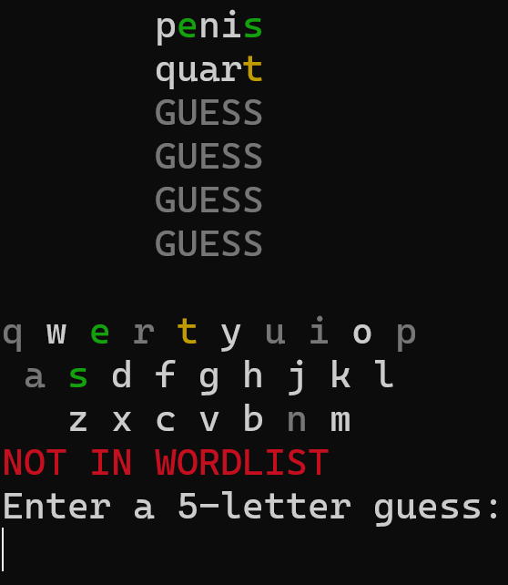
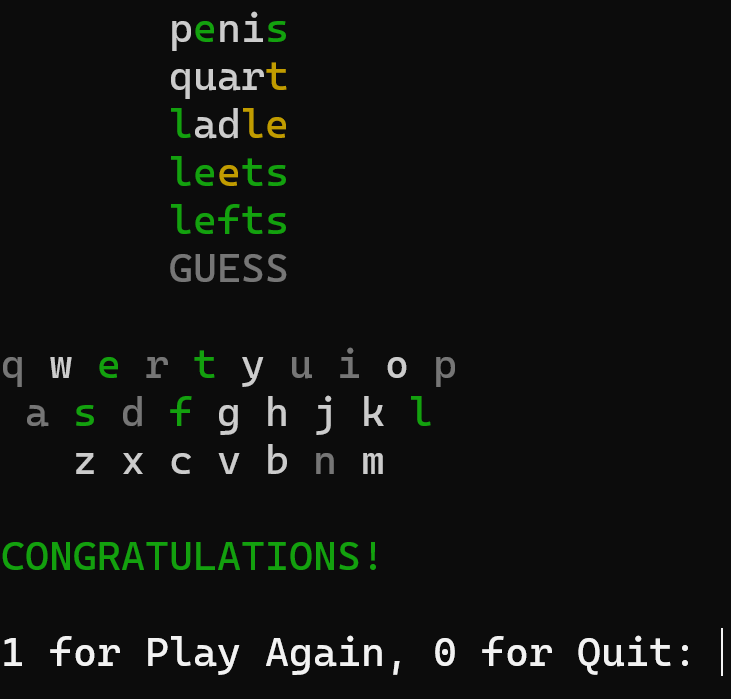

# WordleCloneCpp

Wordle clone written for the terminal in cpp

## words.txt

The file of words is taken from this repository:

[Wordle Words List by dracos](https://gist.github.com/dracos/dd0668f281e685bad51479e5acaadb93)
