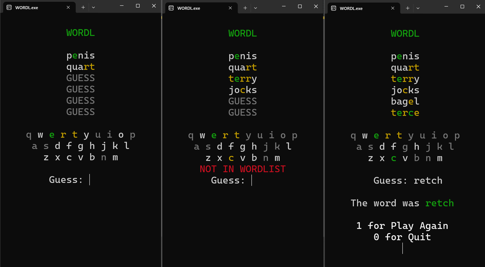

# WordleCloneCpp

Wordle clone written for the terminal in cpp

You can simply download the .exe and play it.

## words.txt

The list of words used is taken from this repository:

[Wordle Words List by dracos](https://gist.github.com/dracos/dd0668f281e685bad51479e5acaadb93)

The .txt file is in the "words folder" and has been "translated" to a .cpp file with just the array, with a python script. The .cpp file with the array is then included in the wordle.cpp and compiled together as below
